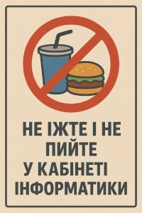
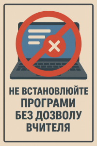

# Правила поведінки в кабінеті інформатики

## 1. Загальні принципи

- 1.1. Кабінет інформатики — навчальний простір. Поводимося професійно, ввічливо, відповідально.
- 1.2. Кожен учень працює під індивідуальним обліковим записом, призначеним школою або викладачем.
- 1.3. Логіни, паролі та двофакторна автентифікація (якщо налаштовано) — суворо особисті. Передача облікових даних карається.

---

## 2. Робота з обладнанням

- 2.1. Заборонено їсти, пити або тримати відкриті контейнери біля комп’ютерів і периферії.

  
- 2.2. Підключати/відключати кабелі, флешки, периферію або відкривати корпуси лише з дозволу вчителя.
- 2.3. Працюємо з периферією обережно: миші, клавіатури, навушники повертаємо на місце; дисплеї не чіпаємо сильними рухами.
- 2.4. Пошкодження або несправність — негайно повідомити викладача; приховування проблеми карається.

---

## 3. Програмне забезпечення та операційні системи

- 3.1. Встановлення або видалення будь-якого ПЗ можливе лише після узгодження з адміністрацією/вчителем.

  
- 3.2. Заборонено намагатися обійти обмеження ОС, установлювати «патчі», зломані програми чи активатори.
- 3.3. Використовувати віртуальні машини для експериментів (якщо дозволено) — лише з образів, наданих вчителем.
- 3.4. Перед початком занять перевіряйте наявність оновлень і робочий стан антивірусного ПЗ (у рамках налаштувань школи).

---

## 4. Безпека даних і приватність

- 4.1. Не завантажувати персональні або конфіденційні дані на загальні робочі станції; використовувати виділені профілі або хмарні акаунти лише за інструкцією.
- 4.2. Чутливі дані (особисті, медичні, фінансові) — не розміщувати в публічних мережах або на загальних дисках.
- 4.3. Робочі файли зберігати у виділених папках, робити резервні копії на шкільному сервері або у хмарі (за політикою школи).
- 4.4. Використання зовнішніх накопичувачів — тільки після перевірки антивірусом.

---

## 5. Мережа та інтернет-етика

- 5.1. Доступ до сайтів регулюється шкільним фільтром — не намагайтесь його обходити (VPN/проксі) без дозволу.
- 5.2. Заборонено перегляд, збереження або розповсюдження незаконного, образливого, порнографічного або екстремістського контенту.
- 5.3. Комунікація онлайн має бути ввічливою — кібербулінг, переслідування, погрози — підлягають дисциплінарним заходам.
- 5.4. Використання соціальних мереж під час занять — за дозволом викладача.

---

## 6. Кібербезпека та етичне хакерство

- 6.1. Проекти, що включають тестування безпеки (сканування мереж, пентести) — дозволені лише в межах лабораторних завдань з чітким письмовим дозволом викладача/адміністрації.
- 6.2. Заборонено спроби отримати адміністративні привілеї, змінювати системні налаштування або доступ до інших акаунтів.
- 6.3. При підозрі на компрометацію облікового запису — негайно повідомити вчителя та змінити пароль (за інструкцією).

---

## 7. Робота з проєктними і командними завданнями

- 7.1. Використовуйте системи контролю версій (Git) для командної роботи. Дотримуйтеся правил именування гілок і комітів, які встановить викладач.
- 7.2. Передавати робочий результат — через затверджені платформи (LMS, шкільний Git, Google Classroom) згідно дедлайну.
- 7.3. Копірайт: при використанні зовнішніх бібліотек/ресурсів — вказуйте авторів та ліцензії.

## 8. Конфіденційність і моніторинг

---

- 8.1. Кабінет може мати програмний моніторинг дій в мережі й на ПК; його мета — безпека та навчальний контроль.
- 8.2. Персональні повідомлення і документи в мережі школи можуть підлягати перевірці в разі інциденту.

## 9. Надзвичайні ситуації та фізична безпека

---

- 9.1. У разі диму, запаху горіння чи іскр — негайно вимкнути обладнання (якщо безпечно) та повідомити вчителя/адміністратора.
- 9.2. Не заблоковуйте проходи й евакуаційні виходи; кабелі мають бути укладені безпечно.
- 9.3. При залитті електроніки — не вмикайте пристрій, сповістіть персонал.

---

## 10. Наслідки порушень

- 10.1. Легке порушення — усне попередження та інструктаж.
- 10.2. Повторні або серйозні порушення — тимчасова або постійна втрата доступу до кабінету; відновлення лише після рішення адміністрації.
- 10.3. Кримінальні порушення (злом, розповсюдження особистих даних, серйозні шкоди) — повідомлення поліції та батьків.

---

## 11. Ролі викладача/адміністрації (коротко)

- 11.1. Забезпечити безпечну інфраструктуру, регулярні бекапи, оновлення й антивірусний захист.
- 11.2. Проводити інструктажі з кібербезпеки та правил роботи з обладнанням.
- 11.3. Наявність процедур резервування й інцидент-репортування.

---

## 12. Процедура звітування про інцидент (швидко)

- 12.1. Зупинити роботу, не намагатися приховати сліди.
- 12.2. Зберегти скріншоти/логи, якщо можливо.
- 12.3. Повідомити вчителя та техпідтримку.
- 12.4. Заповнити інцидент-форму (надає школа).
- 12.5. Дотримуватись інструкцій адміністрації.